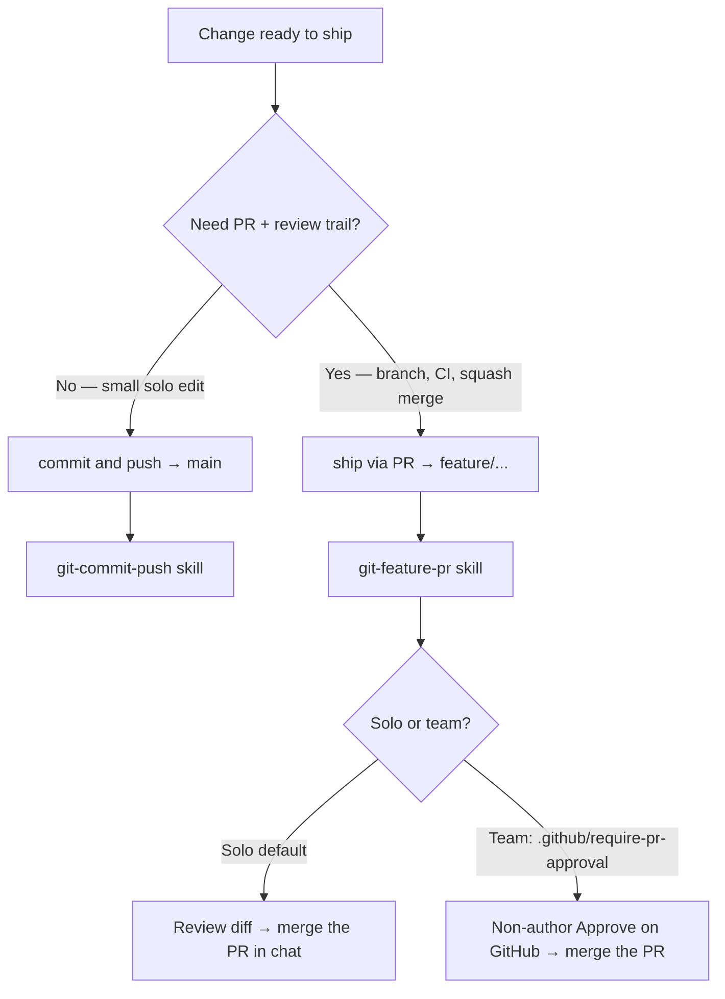

# Agentic workflows (Cursor)

Documentation for **agent-driven workflows** in this repo — how Cursor rules, skills, hooks, and reference docs work together so you can safely commit and push to GitHub from chat.

**Canonical guide:** everything under `agentic-workflows/` is the long-form source of truth. Skills (`.cursor/skills/`) are short agent procedures that link here.

## Start here

| If you are… | Read in order |
|-------------|---------------|
| **New to this repo** | [prerequisites.md](prerequisites.md) → [README.md](README.md) (this page) → [git-commit-push.md](git-commit-push.md) |
| **Not sure what to ask** | Say *"show workflows"* → [workflow-picker.md](workflow-picker.md) |
| **Shipping a change today** | Quick start table below → matching workflow doc |
| **Adding a new agent workflow** | [architecture.md](architecture.md) → create skill + doc → update this README map |
| **Debugging push / auth / PR errors** | [git-commit-push.md § Failure modes](git-commit-push.md#failure-modes) → [prerequisites.md](prerequisites.md) → [gh-docs/git-push-authentication.md](../gh-docs/git-push-authentication.md) |
| **Agent searching from `gh-docs/`** | [gh-docs/agent-git-workflow.md](../gh-docs/agent-git-workflow.md) (index into this folder) |

## Quick start

| You want to… | Say in Cursor chat |
|--------------|-------------------|
| See all options (menu) | *"Show workflows"* or *"What can I do?"* — [workflow-picker.md](workflow-picker.md) |
| Commit only | *"Commit these changes"* |
| Commit and push to `main` | *"Commit and push"* or *"Ship it to GitHub"* |
| Branch → PR → merge | *"Ship via PR"* or *"Branch and PR"* |
| Merge PR (solo: after you review; team: after GitHub Approve) | *"Merge the PR"* |
| PR only (already on branch) | *"Create a pull request"* |

| Path | Skill |
|------|-------|
| Fast — direct `main` | [git-commit-push](../.cursor/skills/git-commit-push/SKILL.md) |
| PR — `feature/` branch | [git-feature-pr](../.cursor/skills/git-feature-pr/SKILL.md) |

Safety guardrails: [git-safety.mdc](../.cursor/rules/git-safety.mdc).

## Which path?



| Mode | Marker | Merge gate |
|------|--------|------------|
| **Solo** (default) | No `.github/require-pr-approval` | Review PR diff → say *"merge the PR"* (GitHub cannot self-approve) |
| **Team** | `.github/require-pr-approval` + branch protection | Non-author **Approve** on GitHub — see [git-feature-pr.md §7](git-feature-pr.md#7--review-before-merge-solo-vs-team) |

## Documentation map

| Doc | What it covers |
|-----|----------------|
| [presync.yaml](presync.yaml) | Optional pre-commit content sync marker (registers infographics in this repo) |
| [infographics-sync.md](infographics-sync.md) | Pre-commit learning infographics for mapped main folders |
| [infographics-folder-map.yaml](infographics-folder-map.yaml) | Which folders get infographics (user-maintained) |
| [infographics-folder-state.yaml](infographics-folder-state.yaml) | Sync progress per folder (agent-updated) |
| [local-quality-checks.md](local-quality-checks.md) | Run CI checks locally before commit |
| [workflow-picker.md](workflow-picker.md) | Discover skills & docs from chat — choose a workflow without memorizing triggers |
| [architecture.md](architecture.md) | Layers (rules, skills, docs, hooks, automations), file formats, **how to add new workflows** |
| [learning-hub-agent-kit-plan.md](learning-hub-agent-kit-plan.md) | Plan to extract reusable workflows into shared learning-hub-agent-kit (modules, install script, phases) |
| [git-commit-push.md](git-commit-push.md) | Full commit & push workflow — steps, permissions, auth, commit style |
| [prerequisites.md](prerequisites.md) | One-time setup: remote, PAT, `gh`, `.gitignore`, permissions |
| [phases.md](phases.md) | Rollout plan — phases 1–3 status |
| [commit-message-examples.md](commit-message-examples.md) | Commit style from `git log` |
| [branch-naming.md](branch-naming.md) | `feature/` branches, name approval |
| [git-feature-pr.md](git-feature-pr.md) | Branch → PR → merge (solo vs team gates) |
| [cursor-automation.md](cursor-automation.md) | Cursor Automations — learn-now guide (Phase 3b deferred) |
| [github-actions.md](github-actions.md) | CI workflows (secret scan, link check, Mermaid/SVG, markdown lint) |

## What is scaffolded

```text
learning-hub-gcp/
├── .cursor/
│   ├── hooks.json
│   ├── hooks/block-secret-commit.sh
│   ├── rules/git-safety.mdc
│   └── skills/
│       ├── workflow-picker/SKILL.md   # list & choose workflows
│       ├── infographics-sync/SKILL.md # pre-commit learning artifacts
│       ├── git-commit-push/SKILL.md
│       ├── git-feature-pr/SKILL.md
│       └── github-pull-request/SKILL.md
├── .github/
│   ├── require-pr-approval          # optional — enables team merge gate (create when collaborators join)
│   └── workflows/secret-scan.yml
├── agentic-workflows/
│   ├── README.md                      # ← start here
│   ├── git-commit-push.md
│   ├── git-feature-pr.md
│   └── …
└── gh-docs/agent-git-workflow.md      # agent index → agentic-workflows/
```

## Related repo docs

- [gh-docs/git-push-authentication.md](../gh-docs/git-push-authentication.md) — HTTPS 401 / askpass fixes
- [gh-docs/README.md](../gh-docs/README.md) — GitHub docs index
- [README.md](../README.md) — learning hub overview

## Design principles

1. **Explicit triggers** — the agent commits only when you ask; it does not auto-commit after edits.
2. **Defense in depth** — rules (always on) + skill (procedure) + `.gitignore` (secrets) + optional hooks (Phase 3).
3. **Repo-local config** — `.cursor/rules` and `.cursor/skills` travel with the repo; anyone cloning gets the same agent behavior.
4. **Progressive disclosure** — `SKILL.md` stays short; detailed prose lives in `agentic-workflows/` and `gh-docs/`.
5. **Solo today, team tomorrow** — PR path works solo without GitHub self-approval; flip to team mode with `.github/require-pr-approval` + branch protection when collaborators join.
