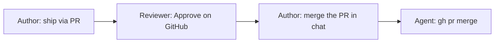

# Adopt learning-hub-agent-kit in your repo

Step-by-step guide to install the shared Cursor agent kit into **any** GitHub repo — solo or team, code or learning content.

**Kit repo:** [github.com/annapantulag/learning-hub-agent-kit](https://github.com/annapantulag/learning-hub-agent-kit)  
**Example consumers:** [learning-hub-gcp](https://github.com/annapantulag/learning-hub-gcp) (full), [python-learnings](https://github.com/annapantulag/python-learnings) (code-only)

---

## What you get

After adoption, the repo has:

| Layer | Path | Purpose |
|-------|------|---------|
| **Rules** | `.cursor/rules/git-safety.mdc` | Always-on guardrails (no force-push to `main`, no secret commits, PR merge gates) |
| **Skills** | `.cursor/skills/*` | Short agent procedures: commit/push, feature-PR, workflow picker |
| **Hooks** | `.cursor/hooks.json` + `hooks/` | Block `git commit` when staged files match secret patterns |
| **Docs** | `agentic-workflows/`, `gh-docs/` | Long-form workflows the agent and humans read |
| **CI** | `.github/workflows/secret-scan.yml` | Scan PRs for leaked secrets |
| **Drift markers** | `.learning-hub-agent-kit-*` | Installed kit version and module list |

Optional (learning repos only): infographics pre-commit sync, folder map, quality-check workflows.

---

## Before you start — prerequisites

Complete this once per machine (not per repo).

### Tools

| Tool | Verify | Install |
|------|--------|---------|
| **git** | `git --version` | [git-scm.com](https://git-scm.com/) |
| **GitHub CLI** | `gh auth status` | `brew install gh` then `gh auth login` |
| **python3** | `python3 --version` | Required for the secret-blocking hook |
| **Cursor** | IDE open on the target repo | [cursor.com](https://cursor.com/) |

### GitHub authentication

Your PAT (fine-grained or classic) needs at least:

| Scope | Why |
|-------|-----|
| **Contents: Read and write** | `git push` / `pull` |
| **Metadata: Read** | `gh repo view`, branch info |
| **Pull requests: Read and write** | `gh pr create`, `gh pr merge` |
| **Workflows: Read and write** | First push that adds `.github/workflows/` |

Full auth guide: [gh-docs/git-push-authentication.md](../gh-docs/git-push-authentication.md)

### Target repo

- Git initialized with `origin` pointing at GitHub
- Default branch is usually `main`
- `.gitignore` excludes secrets (`token.md`, `.env`, `*credentials*.json`, etc.)

---

## Fastest path — `adopt-kit.sh` at repo root

Place the script in your repo root. It resolves **repo** (this directory) and **kit** (sibling clone, env var, or auto-clone to `~/.local/share/learning-hub-agent-kit`) automatically.

### One-time setup per repo

```bash
cd /path/to/your-repo

# Download script to repo root
curl -fsSL https://raw.githubusercontent.com/annapantulag/learning-hub-agent-kit/main/adopt-kit.sh -o adopt-kit.sh
chmod +x adopt-kit.sh
```

Or copy from a local kit clone:

```bash
cp ~/Documents/annapantulag/learning-hub-agent-kit/adopt-kit.sh .
chmod +x adopt-kit.sh
```

### Run (code repo)

```bash
./adopt-kit.sh                    # install + verify
./adopt-kit.sh --commit           # stage and commit adoption files
./adopt-kit.sh --commit --push    # commit and push
```

### Learning repo

```bash
./adopt-kit.sh --learning --commit --push
```

### Later — update from a new kit release

```bash
./adopt-kit.sh --update --commit --push
```

### Script options

| Flag | Effect |
|------|--------|
| `--learning` | Add `infographics` module |
| `--modules a,b,c` | Custom module list |
| `--kit PATH` | Kit clone location (or set `LEARNING_HUB_AGENT_KIT`) |
| `--no-clone` | Do not auto-clone kit to cache |
| `--update` | Re-sync managed files from kit |
| `--check` | Drift check only |
| `--commit` | `git add` adoption paths and commit |
| `--push` | Push after commit |
| `--repo PATH` | Target repo (default: directory containing the script) |

**Kit discovery order:** `--kit` / `$LEARNING_HUB_AGENT_KIT` → `../learning-hub-agent-kit` → `~/.local/share/learning-hub-agent-kit` (cloned from GitHub if missing).

Keep `adopt-kit.sh` in the repo so teammates can run `./adopt-kit.sh --update` after kit releases.

---

## Manual path (install.sh)

| Repo type | Modules | When to use |
|-----------|---------|-------------|
| **Code / app / infra** | `core-git,secrets,docs` | No generated learning hubs or infographics |
| **Learning / docs hub** | `core-git,secrets,docs,infographics` | Course notes, cert prep, hubs with Mermaid diagrams |

| Module | Installs |
|--------|----------|
| `core-git` | Git safety rule + commit/PR/workflow-picker skills |
| `secrets` | Commit hook + `secret-scan` CI workflow |
| `docs` | `agentic-workflows/*.md` + `gh-docs/*.md` |
| `infographics` | Pre-commit sync skill, `presync.yaml`, detect scripts, quality-check workflow |

**Rule:** Never add `infographics` to a pure code repo — it is for learning-content repos only.

---

## Step 2 — Clone the kit (one-time per machine)

```bash
git clone https://github.com/annapantulag/learning-hub-agent-kit.git
cd learning-hub-agent-kit
```

Keep this clone somewhere stable, e.g. `~/Documents/annapantulag/learning-hub-agent-kit`. You will re-use it to install into many repos and to run `--check` / `--update`.

---

## Step 3 — Install into your target repo

Replace `/path/to/your-repo` with the absolute path to the repo you are adopting.

### Code repo (recommended default)

```bash
KIT=~/Documents/annapantulag/learning-hub-agent-kit   # adjust if needed
REPO=/path/to/your-repo

"$KIT/install.sh" --repo "$REPO" --modules core-git,secrets,docs
```

### Learning repo (adds infographics)

```bash
"$KIT/install.sh" --repo "$REPO" --modules core-git,secrets,docs,infographics
```

The script copies module files into the repo root and writes drift markers:

```text
.learning-hub-agent-kit-version
.learning-hub-agent-kit-installed-at
.learning-hub-agent-kit-modules
.learning-hub-agent-kit-manifest
```

---

## Step 4 — Verify the install

```bash
cd /path/to/your-repo

# Drift check against kit VERSION file
"$KIT/install.sh" --check --repo .

# Expected files (code repo)
test -f .cursor/rules/git-safety.mdc && echo "rules OK"
test -f .cursor/skills/git-commit-push/SKILL.md && echo "skills OK"
test -f .cursor/hooks/block-secret-commit.sh && echo "hooks OK"
test -f agentic-workflows/git-commit-push.md && echo "docs OK"
test -f .github/workflows/secret-scan.yml && echo "CI OK"
cat .learning-hub-agent-kit-version
```

**Learning repo only** — confirm infographics module:

```bash
test -f agentic-workflows/presync.yaml && echo "presync OK"
test -f .cursor/skills/infographics-sync/SKILL.md && echo "infographics skill OK"
```

**Code repo** — confirm infographics is **absent**:

```bash
test ! -f agentic-workflows/presync.yaml && echo "no presync (correct for code repo)"
```

---

## Step 5 — Learning repo extras (skip for code repos)

Only if you installed the `infographics` module.

### 5a — Create your folder map

```bash
cd /path/to/your-repo
cp agentic-workflows/infographics-folder-map.example.yaml \
   agentic-workflows/infographics-folder-map.yaml
```

Edit `infographics-folder-map.yaml`: list the top-level content folders that should get learning hubs and diagrams. See [infographics-sync.md](infographics-sync.md).

### 5b — Bootstrap state file

```bash
touch agentic-workflows/infographics-folder-state.yaml
```

The agent updates this after each infographics sync. Start with an empty `folders:` map or copy structure from [learning-hub-gcp](https://github.com/annapantulag/learning-hub-gcp/blob/main/agentic-workflows/infographics-folder-state.yaml).

### 5c — Repo-specific hub customizations

Files the kit does **not** overwrite (you maintain them):

- `agentic-workflows/infographics-folder-map.yaml` — your folder list
- `agentic-workflows/infographics-folder-state.yaml` — sync progress
- `agentic-workflows/study-notes/` — generated study notes
- `agentic-workflows/sources/` — Mermaid `.mmd` / `.svg` pairs
- Extra links in `agentic-workflows/learning-hub.html` (repo-specific docs)

---

## Step 6 — Commit and push adoption

From the target repo:

```bash
cd /path/to/your-repo

git add .cursor agentic-workflows gh-docs .github .learning-hub-agent-kit-*

# Learning repo: also add your customized map (not the .example file alone)
# git add agentic-workflows/infographics-folder-map.yaml

git status   # confirm no secrets staged (token.md, .env, credentials)

git commit -m "$(cat <<'EOF'
Adopt learning-hub-agent-kit for Cursor git workflows.

Installs core-git, secrets, and docs from the shared kit.
EOF
)"

unset GIT_ASKPASS SSH_ASKPASS
export GIT_TERMINAL_PROMPT=1
git push -u origin HEAD
```

Adjust the commit message if you included `infographics` or customized the folder map.

**First push with workflows?** Your PAT needs **Workflows: Read and write** or the push may fail on `.github/workflows/`.

---

## Step 7 — Optional global install (personal machine)

Gives you git skills and the secret hook in **every** repo on this machine — including repos that have not adopted the kit yet.

```bash
cd ~/Documents/annapantulag/learning-hub-agent-kit
./install.sh --global
```

Installs to:

```text
~/.cursor/rules/git-safety.mdc
~/.cursor/skills/{git-commit-push,git-feature-pr,...}
~/.cursor/hooks.json
~/.cursor/hooks/block-secret-commit.sh
~/.cursor/.learning-hub-agent-kit-version
```

**Caveat:** Global skills link to `agentic-workflows/` paths that exist only in repos with the `docs` module. For full doc links, use per-repo install (Step 3). Global is a personal safety net; per-repo is what teammates and CI see.

---

## Step 8 — Use the kit in Cursor chat

Open the adopted repo in Cursor. Try these prompts:

| Goal | Say in chat |
|------|-------------|
| See all workflows | *"Show workflows"* |
| Commit and push to `main` | *"Commit and push"* |
| Ship via feature branch + PR | *"Ship via PR"* |
| Merge after review | *"Merge the PR"* |
| Skip infographics this commit (learning repos) | *"Skip infographics this commit"* |

Full trigger list: [README.md](README.md) · [workflow-picker.md](workflow-picker.md)

---

## Step 9 — Team adoption (when collaborators join)

**Solo (default):** No extra setup. You review the PR diff, then say *"merge the PR"* in chat. GitHub does not allow self-approval — your explicit chat request is the merge gate.

**Team:** Add GitHub branch protection and a repo marker so the agent refuses merge until a **non-author** reviewer Approves on GitHub.

### 9a — GitHub branch protection

1. Open **GitHub → your repo → Settings → Branches**.
2. **Add branch protection rule** for `main`:
   - ☑ Require a pull request before merging
   - ☑ Require approvals: **1**
   - ☑ Dismiss stale pull request approvals when new commits are pushed (recommended)
   - Consider: ☑ Do not allow bypassing the above settings (including admins)
3. Save changes.

### 9b — Add collaborators

**Settings → Collaborators** (or org team access). Grant **Write** or higher so they can branch, push, and approve PRs.

### 9c — Create the team marker file

This empty file tells Cursor skills and `git-safety.mdc` to enforce GitHub `APPROVED` before merge:

```bash
cd /path/to/your-repo
mkdir -p .github
touch .github/require-pr-approval
git add .github/require-pr-approval
git commit -m "Require GitHub PR approval before agent merge."
git push
```

### 9d — Team workflow from then on



| Role | Action |
|------|--------|
| **Author** | *"Ship via PR"* → review CI → ask reviewer |
| **Reviewer** (not the author) | GitHub → PR → **Files changed** → **Approve** |
| **Author** | *"Merge the PR"* in Cursor after `reviewDecision: APPROVED` |

Check PR state:

```bash
gh pr view --json reviewDecision,state,url,mergeable
```

The agent **refuses merge** in team mode until `reviewDecision` is `APPROVED` and you explicitly ask to merge.

Details: [git-feature-pr.md §7](git-feature-pr.md#7--review-before-merge-solo-vs-team)

### 9e — Revert to solo mode

```bash
git rm .github/require-pr-approval
git commit -m "Return to solo PR merge gate."
git push
```

Optionally relax branch protection in GitHub Settings if you are the only contributor again.

---

## Step 10 — Update when the kit releases a new version

```bash
KIT=~/Documents/annapantulag/learning-hub-agent-kit
REPO=/path/to/your-repo

cd "$KIT"
git pull origin main
cat VERSION   # e.g. 0.1.2

# Re-sync managed files (same modules you originally installed)
"$KIT/install.sh" --update --repo "$REPO" --modules core-git,secrets,docs
# or add ,infographics for learning repos

"$KIT/install.sh" --check --repo "$REPO"

cd "$REPO"
git diff   # review overwrites; restore repo-specific files if needed
git add .cursor agentic-workflows gh-docs .github .learning-hub-agent-kit-*
git commit -m "Bump learning-hub-agent-kit to $(cat .learning-hub-agent-kit-version)."
git push
```

Or from repo root if `adopt-kit.sh` is committed:

```bash
./adopt-kit.sh --update --commit --push
```

**Repo-specific files** the kit never manages — safe to keep across updates:

- `agentic-workflows/infographics-folder-map.yaml`
- `agentic-workflows/infographics-folder-state.yaml`
- `agentic-workflows/study-notes/`, `sources/`
- `agentic-workflows/learning-hub-agent-kit-plan.md` (if you added one)
- Custom links in `learning-hub.html`

---

## Troubleshooting

| Symptom | Fix |
|---------|-----|
| `install.sh: command not found` | Use full path: `"$KIT/install.sh" --repo ...` |
| `status: drift` on `--check` | Run `install.sh --update --repo ...` with same modules |
| `git push` 401 | `unset GIT_ASKPASS SSH_ASKPASS`; re-auth — [git-push-authentication.md](../gh-docs/git-push-authentication.md) |
| Push blocked by Cursor Auto-review | Approve the Smart Mode card; agent retries same `git push` |
| `gh pr create` — PAT not accessible | Add **Pull requests: Read and write**; `gh auth login` |
| Push fails on workflows | Add **Workflows: Read and write** to PAT |
| Hook does not run | Confirm `.cursor/hooks.json` committed; restart Cursor; hook needs `python3` |
| Agent commits `token.md` | Should be blocked by hook; add to `.gitignore`; never commit secrets |
| Team merge refused | `gh pr view` — need non-author **Approve** when `.github/require-pr-approval` exists |
| Infographics sync on every commit | Normal for learning repos with `presync.yaml`; say *"skip infographics this commit"* to bypass |
| Global skills — broken doc links | Expected; install `docs` module per repo for full links |

---

## Quick reference — `adopt-kit.sh` (code repo)

```bash
cd /path/to/your-repo
curl -fsSL https://raw.githubusercontent.com/annapantulag/learning-hub-agent-kit/main/adopt-kit.sh -o adopt-kit.sh
chmod +x adopt-kit.sh
./adopt-kit.sh --commit --push
```

## Quick reference — manual install.sh

```bash
# One-time: clone kit
git clone https://github.com/annapantulag/learning-hub-agent-kit.git ~/Documents/annapantulag/learning-hub-agent-kit

# Per repo
KIT=~/Documents/annapantulag/learning-hub-agent-kit
REPO=/path/to/your-repo

"$KIT/install.sh" --repo "$REPO" --modules core-git,secrets,docs
"$KIT/install.sh" --check --repo "$REPO"

cd "$REPO"
git add .cursor agentic-workflows gh-docs .github .learning-hub-agent-kit-*
git commit -m "Adopt learning-hub-agent-kit for Cursor git workflows."
git push -u origin HEAD
```

---

## Related docs

| Doc | Topic |
|-----|-------|
| [learning-hub-agent-kit-plan.md](learning-hub-agent-kit-plan.md) | Migration history and module design |
| [prerequisites.md](prerequisites.md) | PAT, `gh`, Cursor permissions |
| [git-commit-push.md](git-commit-push.md) | Commit and push workflow |
| [git-feature-pr.md](git-feature-pr.md) | PR path, solo vs team merge |
| [infographics-sync.md](infographics-sync.md) | Learning-repo pre-commit sync |
| [architecture.md](architecture.md) | Rules, skills, docs, hooks, CI layers |
