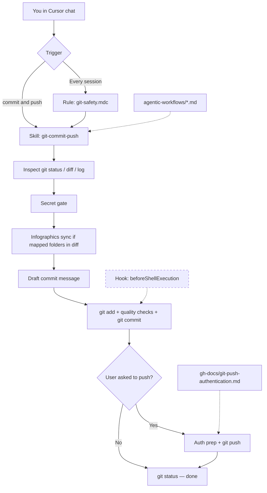
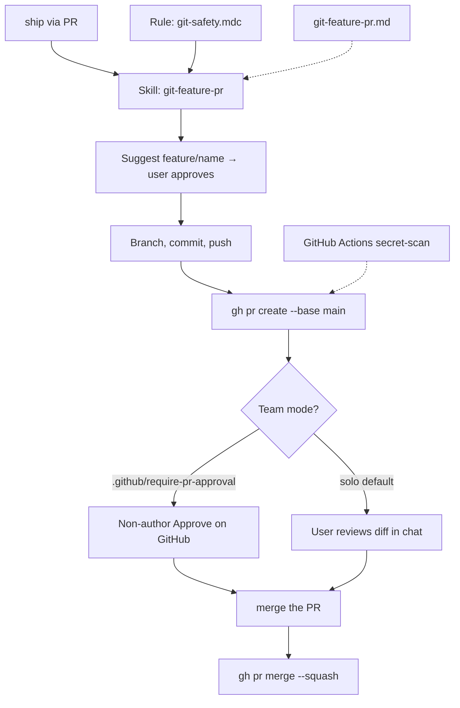
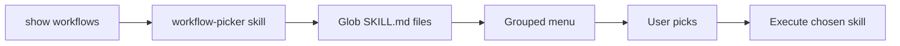

# Architecture — agentic workflows in Cursor

How Cursor pieces fit together for git commit, push, and PR workflows in `learning-hub-gcp`.

## High-level flow (commit & push)



## High-level flow (PR path)



Solid lines = implemented. Dashed = reference / CI.

## Layers

| Layer | Cursor primitive | Format | When it runs | Purpose |
|-------|------------------|--------|--------------|---------|
| **1. Guardrails** | Rule | `.mdc` + YAML frontmatter | Every agent session (`alwaysApply: true`) | Non-negotiable safety: no secret commits, no force-push, commit only when asked |
| **2. Workflow** | Skill | `SKILL.md` + YAML frontmatter | When user asks or description matches | Step-by-step: status → diff → message → commit → push |
| **3. Reference** | Project markdown | `.md` in `agentic-workflows/`, `gh-docs/` | Agent reads when needed | Human-readable detail; linked from skill |
| **4. Enforcement** (optional) | Hook | `hooks.json` + shell script | Before/after agent events | Block `git commit` if staged files match secret patterns |
| **5. Scheduled** (optional) | Cursor Automation | Automations editor (YAML internal) | Cron, git events, Slack, etc. | Autonomous runs without you in chat — usually overkill for routine commits |

### What is *not* a Cursor primitive

- **`instructions.md`** — not a built-in format. Use a **skill** for agent procedure and **markdown docs** for long-form reference.
- **Standalone `.yaml` skill files** — skills are always `SKILL.md` (markdown with a small YAML header).
- **User rules** (Cursor Settings) — global to your account; complement but do not replace project rules/skills.

## File formats

### Skills — `SKILL.md`

Location: `.cursor/skills/<skill-name>/SKILL.md`

```markdown
---
name: git-commit-push
description: Third-person description with trigger terms. Use when user asks to commit or push.
---

# Title

## Workflow
Step-by-step instructions for the agent.
```

- **Body:** Markdown (workflow steps, checklists, links).
- **Frontmatter:** YAML with `name` and `description` only (required).
- **Optional:** `reference.md`, `examples.md`, `scripts/` alongside `SKILL.md`.
- **Scope:** Project skills (`.cursor/skills/`) apply to this repo; personal skills live in `~/.cursor/skills/`.

### Rules — `.mdc`

Location: `.cursor/rules/<rule-name>.mdc`

```markdown
---
description: Short summary for rule picker
alwaysApply: true
---

# Rule title
Bullet list of constraints.
```

- Use `globs: **/*.ts` when the rule should apply only to certain files.
- Keep rules **under ~50 lines**; one concern per file.

### Hooks — `hooks.json`

Location: `.cursor/hooks.json` + `.cursor/hooks/*.sh`

- JSON config mapping events (`beforeShellExecution`, `afterFileEdit`, …) to scripts.
- Scripts receive JSON on stdin; return JSON on stdout to allow/deny/modify.
- See [phases.md](phases.md) for Phase 3 hook design.

### Cursor Automations

- Configured in the **Cursor Automations** editor (Agents Window).
- YAML/JSON wire format is internal; you describe trigger + prompt in plain language.
- Best for: scheduled doc sync, PR bots, Slack-triggered tasks — **not** for everyday "commit my changes now".

### GitHub Actions

- `.github/workflows/*.yml` — CI/CD on GitHub servers.
- Separate from Cursor agent workflows; use for build/test/deploy, not for interactive commit-from-chat.

## Repo layout (current + planned)

```text
learning-hub-gcp/
├── .cursor/
│   ├── hooks.json
│   ├── hooks/block-secret-commit.sh       # Phase 3a ✅
│   ├── rules/git-safety.mdc               # Phase 1 ✅
│   └── skills/
│       ├── workflow-picker/SKILL.md       # discovery menu ✅
│       ├── infographics-sync/SKILL.md     # pre-commit learning artifacts ✅
│       ├── git-commit-push/SKILL.md       # Phase 1 ✅
│       ├── git-feature-pr/SKILL.md        # Phase C ✅
│       └── github-pull-request/SKILL.md   # Phase 2 ✅
├── .github/
│   ├── scripts/
│   │   ├── detect-infographics-folders.sh # scope detection ✅
│   │   ├── detect-infographics-folders.py
│   │   └── run-quality-checks.sh
│   ├── require-pr-approval              # optional — team merge gate
│   └── workflows/secret-scan.yml          # Phase 3c ✅
├── agentic-workflows/
│   ├── README.md
│   ├── architecture.md
│   ├── infographics-sync.md             # pre-commit infographics ✅
│   ├── infographics-folder-map.yaml     # user-maintained folder list ✅
│   ├── infographics-folder-state.yaml   # agent sync progress ✅
│   ├── AGENT-infographics.md            # workflow hub agent doc ✅
│   ├── learning-hub.html                # workflow learning hub ✅
│   ├── workflow-picker.md
│   ├── git-commit-push.md
│   ├── git-feature-pr.md                # Phase C ✅
│   ├── commit-message-examples.md
│   ├── branch-naming.md
│   ├── cursor-automation.md
│   ├── github-actions.md
│   ├── prerequisites.md
│   └── phases.md
├── gh-docs/
│   ├── agent-git-workflow.md
│   ├── git-push-authentication.md
│   └── ...
└── .gitignore
```

**Note:** Topic-specific skills under `get-cert-gear-prof-de-gcp/.cursor/skills/` apply only within that subtree. Repo-wide git workflow lives at **repo root** `.cursor/`.

## Skills vs rules vs docs — decision guide

| Question | Use |
|----------|-----|
| Must the agent *always* follow this? | **Rule** (`alwaysApply: true` or `globs`) |
| Is this a multi-step procedure on request? | **Skill** |
| Is this long reference material? | **Doc** in `agentic-workflows/` or `gh-docs/` |
| Must a bad command be *blocked* programmatically? | **Hook** |
| Should this run on a schedule without chat? | **Cursor Automation** |

## Permissions (agent shell)

| Action | Typical permission |
|--------|-------------------|
| `git status`, `git diff`, `git log` | Default sandbox |
| `git add`, `git commit` | `git_write` |
| `git push`, `gh pr create` | `network` or `all` |

The skill instructs the agent to request the right permissions when push fails in sandbox.

## Workflow picker (discovery)

Users do not need to memorize every trigger phrase. The [workflow-picker](../.cursor/skills/workflow-picker/SKILL.md) skill scans `.cursor/skills/**/SKILL.md` and `agentic-workflows/*.md`, presents a menu (AskQuestion or numbered list), then loads the chosen skill.

| Concern | Approach |
|---------|----------|
| **Maintenance** | New skills appear automatically when `SKILL.md` + frontmatter exist |
| **Static quick start** | [README.md](README.md) table for frequent git paths |
| **Full guide** | [workflow-picker.md](workflow-picker.md) |



## Extending to other workflows

Same pattern for future agentic workflows (e.g. "regenerate SVGs from Mermaid", "open learning hub in browser"):

1. Add `.cursor/skills/<workflow-name>/SKILL.md` with `name`, `description`, and trigger terms in frontmatter
2. Add `agentic-workflows/<workflow-name>.md` with full procedure, failure modes, and examples
3. Add a focused rule (`.cursor/rules/*.mdc`) **only** if always-on constraints are needed
4. Link from [README.md](README.md) documentation map and [phases.md](phases.md) if part of rollout
5. Optional: hook or GitHub Action if the workflow needs programmatic enforcement

**Checklist before merging workflow docs:**

| Item | Done? |
|------|-------|
| Skill description includes chat triggers | |
| Long-form doc linked from skill | |
| Local quality checks before commit documented | [local-quality-checks.md](local-quality-checks.md) |
| README documentation map updated | |
| Failure modes table in workflow doc | |
| Prerequisites (tools, PAT scopes, permissions) documented | |
| `gh-docs/agent-git-workflow.md` index updated if git-related | |
