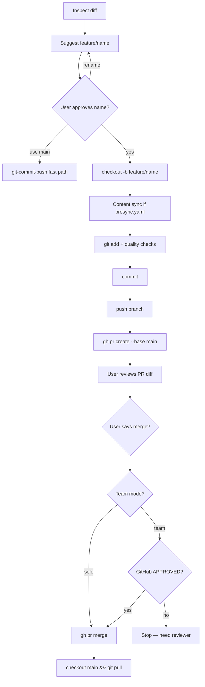

# Git feature branch → PR → merge

End-to-end workflow for shipping changes via a **`feature/`** branch and pull request into **`main`**.

**Agent entry point:** [`.cursor/skills/git-feature-pr/SKILL.md`](../.cursor/skills/git-feature-pr/SKILL.md)  
**Fast path (direct `main`):** [git-commit-push.md](git-commit-push.md)

## When to use

| Use PR path | Use fast path (`main`) |
|-------------|------------------------|
| Larger or multi-folder changes | Small doc tweaks |
| Want review before merge | Solo quick fixes |
| Avoid Auto-review on `main` push | Already comfortable pushing `main` |

## Chat triggers

- *"Ship via PR"*
- *"Branch and PR"*
- *"Create feature branch, commit, push, and open PR"*
- *"Merge the PR"* (merge step — solo review or team GitHub Approve)

## Workflow overview



## Step-by-step

### 1 — Inspect

```bash
git status
git diff
git log -5 --format='%s'
git branch -vv
```

### 2 — Suggest branch name

Format: `feature/<kebab-topic>` derived from changed paths.

**Prefer AskQuestion** (same pattern as [workflow-picker](workflow-picker.md)): approve suggested name, pick *use main* for fast path, or *rename* and type a new `feature/...` name. Fall back to plain-text prompt if AskQuestion is unavailable.

**Wait for approval** before `git checkout -b`.

### 3 — Branch from updated `main`

```bash
git checkout main
git pull --rebase origin main
git checkout -b feature/<approved-topic>
```

### 4 — Stage, content sync, quality checks, commit

Same secret gate and message style as [git-commit-push.md](git-commit-push.md).

Pre-commit content sync: same as git-commit-push Step 2.5 — run when [presync.yaml](presync.yaml) exists. **This repo:** registers infographics — see [infographics-sync.md](infographics-sync.md).

```bash
git add <paths>
# presync detect_script from presync.yaml when present
bash .github/scripts/run-quality-checks.sh
git commit -m "$(cat <<'EOF'
Your message.

EOF
)"
```

Do not commit until [local-quality-checks.md](local-quality-checks.md) pass. Update [infographics-folder-state.yaml](infographics-folder-state.yaml) after sync when presync ran.

### 5 — Push feature branch

```bash
unset GIT_ASKPASS SSH_ASKPASS
export GIT_TERMINAL_PROMPT=1
git push -u origin HEAD
```

Feature-branch pushes rarely trigger Auto-review on `main`. Retry with Smart Mode approval if blocked.

### 6 — Create PR

**Base branch:** `main` by default.

```bash
gh pr create --base main --title "..." --body "$(cat <<'EOF'
## Summary
- …

## Test plan
- [ ] …

EOF
)"
```

**Other base:** only when user explicitly says so, e.g. *"PR against `release/2026`"*:

```bash
gh pr create --base release/2026 ...
```

Return the PR URL.

### 7 — Review before merge (solo vs team)

GitHub **does not allow you to approve your own PR**. The merge gate depends on whether the repo expects a second reviewer.

| Mode | When | Merge gate |
|------|------|------------|
| **Solo** (default) | Only you commit; no `.github/require-pr-approval` | Review the PR diff on GitHub (or in Cursor), then say *"merge the PR"* — explicit chat request is your sign-off |
| **Team** | Collaborators added | GitHub **Approve** from someone who did **not** author the PR, plus branch protection (below) |

Check PR state:

```bash
gh pr view --json reviewDecision,state,url,mergeable
```

- `CHANGES_REQUESTED` → refuse merge; fix and re-request review
- **Solo mode** → merge when user explicitly asks and PR is `OPEN` + `MERGEABLE`
- **Team mode** → merge only when `reviewDecision: "APPROVED"` and user asks

#### Enable team review (when collaborators join)

1. **GitHub → Settings → Branches → Add rule** on `main`:
   - Require a pull request before merging
   - Require **1** approving review
   - Consider disabling “Allow bypass” for admins if you want strict review
2. Add collaborators with **Write** access.
3. Create marker file (tells the agent to enforce approval):

   ```bash
   touch .github/require-pr-approval
   git add .github/require-pr-approval
   git commit -m "Require GitHub PR approval before agent merge."
   ```

4. From then on, only a **non-author** reviewer can Approve; the agent refuses merge until `reviewDecision: "APPROVED"`.

#### Solo operator today

- Use the PR for **history, diff, and CI** — not because you need a second human.
- Open the PR → scan **Files changed** → say *"merge the PR"* when satisfied.
- Alternative for tiny edits: skip the PR path and use *"commit and push"* to `main` ([git-commit-push.md](git-commit-push.md)).

### 8 — Merge (explicit user request only)

Only when user says *"merge the PR"* / *"merge it"*:

```bash
gh pr view --json reviewDecision,state,number,mergeable
```

**Team mode** — `.github/require-pr-approval` exists in the repo:

- Require `reviewDecision == APPROVED` (non-author reviewer on GitHub)
- If not approved → stop; tell user a collaborator must **Approve**

**Solo mode** (default — file absent):

- GitHub cannot self-approve; explicit user merge request = operator sign-off
- Proceed if PR is `OPEN`, `MERGEABLE`, and `reviewDecision != CHANGES_REQUESTED`

Then:

```bash
gh pr merge --squash --delete-branch
git checkout main
git pull origin main
```

- Default merge: **squash** (clean `main` history)
- User can request `--merge` or `--rebase` explicitly
- Never merge without user request

### 9 — Verify

```bash
git status
git log -3 --oneline
```

## Non-`main` branches (fast path)

The [git-commit-push](git-commit-push.md) skill works on **any** branch. If you are already on `feature/...` and only need commit + push (no new PR), say *"commit and push"* — no need to run the full PR flow again.

## Failure modes

| Symptom | Action |
|---------|--------|
| User has not approved branch name | Do not `checkout -b` |
| `gh pr create` — Resource not accessible by PAT | Add **Pull requests: Read and write** to PAT; `gh auth login` — see [prerequisites.md](prerequisites.md) |
| Merge requested, team mode, not approved | Run `gh pr view`; need non-author **Approve** on GitHub |
| Merge requested, solo mode | Review diff; explicit *"merge the PR"* is sufficient — no GitHub self-approve |
| Wrong base branch | Default `main`; only change when user specifies |
| Branch not `feature/` prefix | Rename suggestion to `feature/...` |
| `workflow` scope error on push | See [git-push-authentication.md](../gh-docs/git-push-authentication.md) |

## Related

- [branch-naming.md](branch-naming.md)
- [commit-message-examples.md](commit-message-examples.md)
- [`.cursor/skills/github-pull-request/SKILL.md`](../.cursor/skills/github-pull-request/SKILL.md) — PR-only (subset of this flow)
