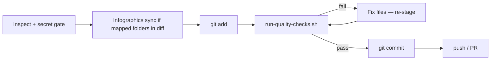

# Local quality checks (before commit)

Run the same checks as [Quality checks CI](github-actions.md) **on your machine before `git commit`** — not only on GitHub runners. Catching markdown-lint or broken HTML links locally saves a failed PR cycle.

**Agent rule:** commit and PR skills run these checks after staging and **before** `git commit`. Do not commit until they pass.

## One command

From repo root (Node 20+ for markdownlint via `npx`; Python 3 for HTML links):

```bash
bash .github/scripts/run-quality-checks.sh
```

Subcommands (same as CI jobs):

```bash
bash .github/scripts/run-quality-checks.sh markdown-lint
bash .github/scripts/run-quality-checks.sh html-links
bash .github/scripts/run-quality-checks.sh mermaid-svg
```

## What each check does

| Check | When it matters | Fix |
|-------|-----------------|-----|
| **html-links** | Edited `learning-hub.html` | Fix broken relative `href` paths |
| **mermaid-svg** | Edited `.mmd` diagrams | Regenerate sibling `.svg` (see [github-actions.md](github-actions.md)) |
| **infographics-integrity** | Edited folder map or state | Align `infographics-folder-map.yaml`, `infographics-folder-state.yaml`, and hub files — see [infographics-sync.md](infographics-sync.md) |
| **markdown-lint** | Edited `agentic-workflows/`, `gh-docs/`, `.cursor/skills/`, root `README.md` | Fix reported rule (e.g. MD036 — use `###` headings, not bold alone) |

Config: [`.markdownlint-cli2.yaml`](../.markdownlint-cli2.yaml)

## Where this fits in agent workflows



Detection: `bash .github/scripts/detect-infographics-folders.sh` — see [infographics-sync.md](infographics-sync.md).

| Workflow | Doc |
|----------|-----|
| Commit & push | [git-commit-push.md](git-commit-push.md) — Step 3 |
| Ship via PR | [git-feature-pr.md](git-feature-pr.md) — before commit step |

## Failure modes

| Symptom | Action |
|---------|--------|
| `MD036/no-emphasis-as-heading` | Replace standalone `**Section**` with `### Section` |
| `Missing paired SVG` | `npx -p @mermaid-js/mermaid-cli mmdc -i path/to/diagram.mmd -o path/to/diagram.svg` |
| Broken `href` in HTML hub | Correct relative path in `learning-hub.html` |
| `npx` / Node missing | Install Node 20+ or run checks in CI only (not recommended for workflow docs) |

## Related

- [github-actions.md](github-actions.md) — CI workflow detail
- [git-commit-push.md](git-commit-push.md)
- [git-feature-pr.md](git-feature-pr.md)
