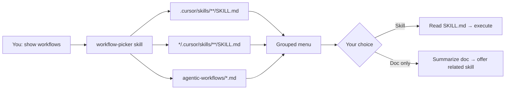

# Workflow picker — choose what to do

You do not need to memorize every chat trigger or skill name. Say **"show workflows"** (or **"what can I do?"**) and the agent scans this repo, lists what is available, and lets you **pick** from the menu.

## Is this a good idea?

**Yes.** It matches how this repo is designed:

| Layer | You interact with | Agent uses |
|-------|-------------------|------------|
| **Picker** | A short menu in chat | [workflow-picker](../.cursor/skills/workflow-picker/SKILL.md) skill |
| **Workflow** | Your choice (number or label) | Matching `.cursor/skills/*/SKILL.md` |
| **Reference** | Optional deep reading | `agentic-workflows/*.md`, `gh-docs/` |

### Benefits

- **Discoverability** — new workflows appear automatically when someone adds a skill; no cheat sheet to maintain by hand.
- **Lower cognitive load** — choose *"ship via PR"* instead of recalling branch naming, merge gates, and skill names.
- **Same safety** — the picker only lists options; git rules ([git-safety.mdc](../.cursor/rules/git-safety.mdc)) still apply after you choose.

### Trade-offs

- One extra turn in chat (menu → choice → run). For power users who already know the trigger, saying *"commit and push"* is still faster.
- Topic-scoped skills (under e.g. `get-cert-gear-prof-de-gcp/.cursor/skills/`) show up when relevant to that tree; the picker may list more than git workflows as the repo grows.

**Naming:** Call it a **workflow picker** in docs; technically it is a **Cursor skill** that catalogs other skills and reference docs. Both terms are fine.

## How to use it

| You say | Agent does |
|---------|------------|
| *"Show workflows"* | Scans skills + docs → presents menu |
| *"What can I do?"* | Same |
| *"Workflow menu"* / *"Pick a workflow"* | Same |
| *"Help me get started"* | Menu biased toward prerequisites + shipping paths |
| Reply **2** or *"Ship via PR"* | Loads [git-feature-pr](../.cursor/skills/git-feature-pr/SKILL.md) and runs it |

In Cursor, the agent may show native **multiple-choice** UI (AskQuestion) when supported; otherwise you get a numbered list in chat.

## What gets discovered

### Repo-wide workflows (today)

| Skill | Typical use | After you pick |
|-------|-------------|----------------|
| [git-commit-push](../.cursor/skills/git-commit-push/SKILL.md) | Commit and/or push to `main` | [git-commit-push.md](git-commit-push.md) |
| [infographics-sync](../.cursor/skills/infographics-sync/SKILL.md) | Sync learning infographics before commit | [infographics-sync.md](infographics-sync.md) |
| [git-feature-pr](../.cursor/skills/git-feature-pr/SKILL.md) | `feature/` branch → PR → merge | [git-feature-pr.md](git-feature-pr.md) |
| [github-pull-request](../.cursor/skills/github-pull-request/SKILL.md) | Open a PR (already on a branch) | [git-feature-pr.md](git-feature-pr.md) § PR only |
| [workflow-picker](../.cursor/skills/workflow-picker/SKILL.md) | List options again | This page |

### Topic-scoped workflows

Skills under a subdirectory (e.g. `get-cert-gear-prof-de-gcp/.cursor/skills/`) apply when working in that part of the repo. The picker includes them with their folder path so you can tell scope apart.

### Reference docs (not runnable alone)

These support workflows but are not skills — the picker may offer to open or summarize them:

| Doc | Purpose |
|-----|---------|
| [prerequisites.md](prerequisites.md) | One-time PAT, `gh`, remote setup |
| [architecture.md](architecture.md) | How rules, skills, hooks fit together |
| [branch-naming.md](branch-naming.md) | `feature/` branch conventions |
| [commit-message-examples.md](commit-message-examples.md) | Commit style |
| [infographics-sync.md](infographics-sync.md) | Pre-commit infographics workflow |
| [github-actions.md](github-actions.md) | CI checks |
| [cursor-automation.md](cursor-automation.md) | Scheduled Cursor automations |
| [phases.md](phases.md) | Rollout status |

## Relationship to README quick start

[README.md](README.md) **Quick start** is a **static** table of the most common git triggers. The workflow picker is **dynamic** — it reads `SKILL.md` files on demand so new workflows show up without editing the README.

Use whichever you prefer:

- **Know what you want** → say the trigger (*"commit and push"*)
- **Not sure** → *"show workflows"*

## Adding a new workflow

When you add a workflow, the picker finds it automatically if you follow the standard layout ([architecture.md § Extending](architecture.md#extending-to-other-workflows)):

1. `.cursor/skills/<name>/SKILL.md` with `name` and `description` in frontmatter (description = one-line menu text)
2. `agentic-workflows/<name>.md` for long-form detail
3. Link from [README.md](README.md) documentation map (optional but recommended for humans)

No change to `workflow-picker` is required unless you want a new **category** or special sorting.

## Failure modes

| Situation | What to do |
|-----------|------------|
| Menu is empty or scan fails | Agent falls back to README quick-start table |
| Too many options | Reply with keywords (*"git"*, *"infographics"*) to narrow |
| Picked reference doc, want action | Say *"run that"* or pick the related skill from a follow-up menu |
| Personal Cursor skills (`~/.cursor/skills/`) | Not scanned — project repo only |

## Related

- [README.md](README.md) — overview and static quick start
- [architecture.md](architecture.md) — skills vs rules vs docs
- [gh-docs/agent-git-workflow.md](../gh-docs/agent-git-workflow.md) — agent index for git topics
