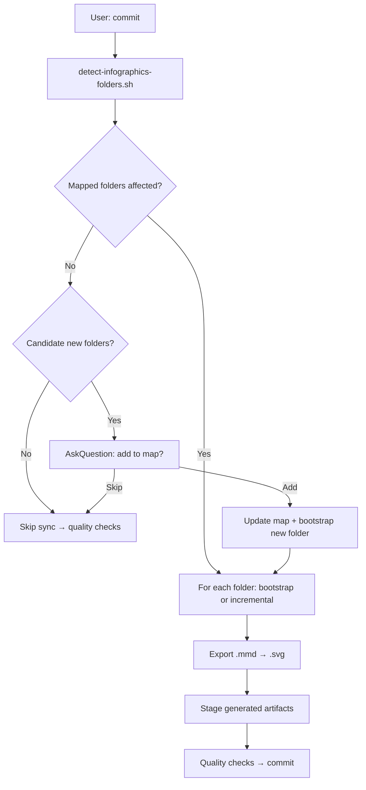

# Infographics sync — pre-commit learning artifacts

Keep **learning infographics** in sync with repo changes **before** quality checks and commit. Infographics are not decorative — they are the **go-to guide** for deep knowledge building and hands-on implementation.

**Agent entry point:** [`.cursor/skills/infographics-sync/SKILL.md`](../.cursor/skills/infographics-sync/SKILL.md)  
**Folder map:** [infographics-folder-map.yaml](infographics-folder-map.yaml)  
**Invoked from:** [git-commit-push.md](git-commit-push.md) Step 2.5 (when user asks to commit)

## Purpose

Every mapped main folder should give a learner:

| Outcome | Artifacts |
|---------|-----------|
| **Understand deeply** | Study notes with exam/production judgment, traps, teach-it-back sections |
| **Decide correctly** | Decision trees and pipeline flows (not service bullet lists) |
| **Implement** | Labs and command paths with *why* each step matters |
| **Find everything** | Topic or folder `learning-hub.html` as single entry point |
| **Trust coverage** | `00-coverage-map.md` — every source section mapped to note or gap |

**Reject** infographic work that only adds files without teaching value (orphan `.mmd`, hub links with empty retain panels, generic copy not grounded in folder source material).

## Triggers

| User intent | Agent behavior |
|-------------|----------------|
| *"Commit"* / *"Commit and push"* | Run infographics sync **if** mapped or candidate folders appear in diff; else skip silently |
| *"Sync infographics"* | Run sync explicitly (even without commit) |
| *"Skip infographics this commit"* | User override — proceed to quality checks without sync |
| Normal edits | **No** auto-sync |

## When sync runs vs skips

**Run** when staged, unstaged, or untracked paths touch:

- Any `path` in [infographics-folder-map.yaml](infographics-folder-map.yaml) (`folders[].path`)
- Any **candidate new folder** (see below)

**Skip silently** when the diff touches **only** paths under `ignore_prefixes` in the map (e.g. `gh-docs/`, `.github/`, `.cursor/rules`) or other unmapped infra paths with no content-learning value.

## Workflow overview



## Step-by-step (agent)

### 1 — Detect scope

```bash
bash .github/scripts/detect-infographics-folders.sh
```

Implementation: [`.github/scripts/detect-infographics-folders.py`](../.github/scripts/detect-infographics-folders.py) (stdlib only; no PyYAML).

**JSON output:**

| Field | Meaning |
|-------|---------|
| `skip_sync` | `true` — no mapped folders or candidates; skip sync silently |
| `ignored_only` | All changed paths are under `ignore_prefixes` |
| `changed_count` | Total paths from diff + untracked |
| `affected[]` | Mapped folders to sync |
| `affected[].mode` | `bootstrap` (marker missing) or `incremental` |
| `affected[].subpaths` | Changed files under that folder |
| `affected[].topic_subfolders` | For `topic_subfolders` scope — changed `mod-*`, `skill-*`, `sec-*` |
| `candidates[]` | Unmapped roots with changes (prompt user to add to map) |
| `placeholder_touched[]` | Mapped `status: placeholder` folders touched — report, do not sync |
| `folder_registry[]` | **All** mapped folders with `hub_status` + `agent_note` — read even when `skip_sync` |

Example (bootstrap — no hub yet):

```json
{
  "skip_sync": false,
  "affected": [
    {
      "path": "agentic-workflows",
      "mode": "bootstrap",
      "scope": "folder_root",
      "agent_doc": "agentic-workflows/AGENT-infographics.md",
      "subpaths": ["agentic-workflows/git-commit-push.md"]
    }
  ],
  "candidates": []
}
```

If `skip_sync` is `true`, proceed to [git-commit-push.md](git-commit-push.md) Step 3 (quality checks).

Respect user override: *"skip infographics this commit"*.

### 2 — Candidate new folders

Collect changed paths **not** under any mapped `folders[].path` and **not** under `ignore_prefixes`.

Heuristic: top-level directory or `udemy/<course>/` with `.md` or learning content (not dot dirs).

**AskQuestion** (or plain-language prompt):

| Option | Action |
|--------|--------|
| **Add and bootstrap** | Append to `infographics-folder-map.yaml`, scaffold AGENT doc + hub if missing, **full bootstrap infographics**, stage artifacts |
| **Skip this commit** | No map change; continue to quality checks |
| **Ignore always** | Add path to `ignore_prefixes` in map (only if user asks) |

Adding to the map **always** triggers bootstrap in the same session — not metadata-only.

### 3 — Bootstrap vs incremental

| Condition | Mode | Agent action |
|-----------|------|--------------|
| `bootstrap_marker` missing (e.g. no `learning-hub.html`) | **bootstrap** | Process entire folder per folder `agent_doc` |
| Marker exists | **incremental** | Update only changed subpaths |

**Scope types** (`scope` in map):

| Value | Incremental behavior |
|-------|----------------------|
| `folder_root` | Refresh notes/diagrams/hub for changed `.md` and related assets under folder root |
| `topic_subfolders` | Only changed `mod-*`, `skill-*`, `sec-*` subfolders with source content |

**Placeholder folders** (`status: placeholder`): skip until source content exists; report once if diff touches them.

### 4 — Delegate to folder AGENT doc

For each affected folder:

1. Read `agent_doc` (and `skill` if set) from the map.
2. Follow folder-specific phases — cert uses Phases A–F in `get-cert-gear-prof-de-gcp/docs/AGENT-infographics.md`.
3. Apply the **quality bar** (this doc § Purpose) before staging.

### 5 — Export SVGs

```bash
npx @mermaid-js/mermaid-cli -i <path>.mmd -o <path>.svg
```

Every new or changed `.mmd` needs a sibling `.svg`.

### 6 — Stage and hand off

```bash
git add <generated paths>
```

Return to [git-commit-push.md](git-commit-push.md) Step 3 (quality checks).

## Folder map format

See [infographics-folder-map.yaml](infographics-folder-map.yaml).

| Field | Required | Meaning |
|-------|----------|---------|
| `path` | yes | Repo-relative main folder |
| `label` | yes | Human name for menus |
| `agent_doc` | yes | Folder-specific generation rules |
| `skill` | no | Optional Cursor skill path |
| `scope` | yes | `folder_root` or `topic_subfolders` |
| `bootstrap_marker` | yes | File whose absence triggers full bootstrap |
| `parent_hub` | no | Aggregate hub (cert prep) |
| `status` | no | `active` (default) or `placeholder` |
| `hub_status` | yes | `complete` · `needs_bootstrap` · `not_started` — agent guidance for next run |
| `agent_note` | yes | Human + agent readable: incremental vs skip vs placeholder |

## Folder tracking (map + state)

**Yes — keep track.** Two files help the next agent iteration:

| File | Who edits | Purpose |
|------|-----------|---------|
| [infographics-folder-map.yaml](infographics-folder-map.yaml) | **User** | Which folders exist, `hub_status`, `agent_note` per folder |
| [infographics-folder-state.yaml](infographics-folder-state.yaml) | **Agent** after each sync | Progress: `bootstrap_complete`, `diagram_count`, `expected_sync_mode`, `last_sync_commit` |

The detection script emits **`folder_registry`** (all mapped folders + notes) even when `skip_sync` is true — so the agent always knows:

- `udemy/dataflow` → placeholder, **skip**
- `get-cert-gear-prof-de-gcp` / `udemy/dataform` → **incremental only**
- `agentic-workflows` / `gcp-de-saidhul-course` → hub complete, incremental on change

After bootstrap or incremental sync, update **state file** (`hub_status`, `diagram_count`, `expected_sync_mode`). Update **map** `hub_status` when bootstrap completes.

## Mapped folders (initial)

| Path | Scope | AGENT doc |
|------|-------|-----------|
| `get-cert-gear-prof-de-gcp` | topic subfolders | Existing PDE cert doc |
| `udemy/dataform` | folder root | [udemy/dataform/docs/AGENT-infographics.md](../udemy/dataform/docs/AGENT-infographics.md) |
| `agentic-workflows` | folder root | [AGENT-infographics.md](AGENT-infographics.md) |
| `gcp-de-saidhul-course` | folder root | [gcp-de-saidhul-course/AGENT-infographics.md](../gcp-de-saidhul-course/AGENT-infographics.md) |
| `udemy/dataflow` | folder root | [udemy/dataflow/docs/AGENT-infographics.md](../udemy/dataflow/docs/AGENT-infographics.md) (placeholder) |

## Adding a new main folder

1. User confirms via AskQuestion during commit flow **or** edits the map directly.
2. Add entry to `infographics-folder-map.yaml`.
3. Create or follow `AGENT-infographics.md` in that folder (see [Mapped folders](#mapped-folders-initial)).
4. Bootstrap: `sources/`, `study-notes/`, `learning-hub.html`, `00-coverage-map.md`.
5. Run sync; stage; continue commit flow.

## Failure modes

| Symptom | Action |
|---------|--------|
| No mapped folders in diff | Skip sync silently |
| `agent_doc` missing | Create scaffold (Step 3) or stop and report |
| `.mmd` without `.svg` | Export with mermaid-cli; re-run quality checks |
| User wants typo-only commit | Say *"skip infographics this commit"* |
| Placeholder folder changed | Report: add source content or remove placeholder status |
| Infographics would be shallow | Expand study notes and decision trees — do not commit checkbox artifacts |

## Test plan

Manual verification after workflow changes (run from repo root):

### 1 — Detection script

```bash
bash .github/scripts/detect-infographics-folders.sh
```

| Scenario | Expected |
|----------|----------|
| Changes under mapped folder (e.g. `agentic-workflows/`) | `skip_sync: false`, `affected[].mode: incremental` (hub exists) |
| Changes **only** under `ignore_prefixes` (e.g. `gh-docs/` alone) | `skip_sync: true`, `folder_registry` still lists all folders |
| Changes under `udemy/dataflow/` (placeholder) | `placeholder_touched[]` populated, not in `affected[]` |
| New unmapped top-level folder with `.md` | `candidates[]` populated — agent AskQuestion |

Quick check for infra-only skip (staged):

```bash
# Example: stage only gh-docs change, then:
bash .github/scripts/detect-infographics-folders.sh | python3 -c "import json,sys; d=json.load(sys.stdin); print('skip_sync', d['skip_sync'])"
```

### 2 — Commit flow (agent)

| You say | Agent should |
|---------|--------------|
| *Commit* with mapped folder in diff | Run detect → read `folder_registry` → incremental sync → quality checks → commit |
| *Skip infographics this commit* | Jump from Step 2.5 to quality checks |
| *Commit* with only `gh-docs/` change | Skip infographics silently |

### 3 — PR flow

Same infographics gate as commit — see [git-feature-pr.md](git-feature-pr.md) Step 4.

### 4 — Quality checks

```bash
bash .github/scripts/run-quality-checks.sh
bash .github/scripts/run-quality-checks.sh infographics-integrity
python3 .github/scripts/test_detect_infographics_folders.py
```

Must pass before commit: HTML links, Mermaid/SVG pairs, **infographics map/state integrity**, markdown-lint on workflow docs.

### 5 — Hubs (Live Server or local HTTP)

Open and spot-check navigation (diagrams lazy-load — visit each panel to render Mermaid):

- [agentic-workflows/learning-hub.html](learning-hub.html) — diagrams 01–03 render (shipping paths, layers, commit pipeline)
- [gcp-de-saidhul-course/learning-hub.html](../gcp-de-saidhul-course/learning-hub.html) — resource map + external links + sessions checklist

Local smoke test:

```bash
python3 -m http.server 8765
# open http://127.0.0.1:8765/agentic-workflows/learning-hub.html
```

## Related

- [git-commit-push.md](git-commit-push.md) — commit flow including Step 2.5
- [local-quality-checks.md](local-quality-checks.md) — runs after sync
- [get-cert-gear-prof-de-gcp/docs/AGENT-infographics.md](../get-cert-gear-prof-de-gcp/docs/AGENT-infographics.md) — reference implementation
- [udemy/dataform/learning-hub.html](../udemy/dataform/learning-hub.html) — reference hub
